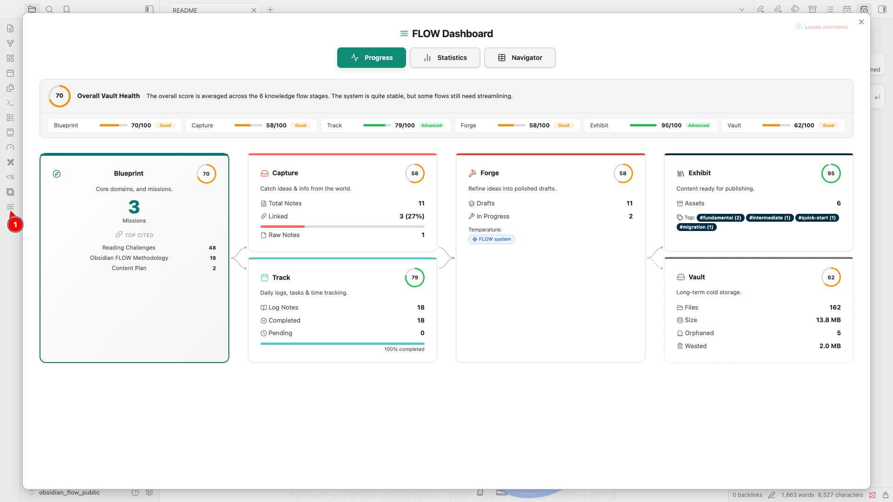
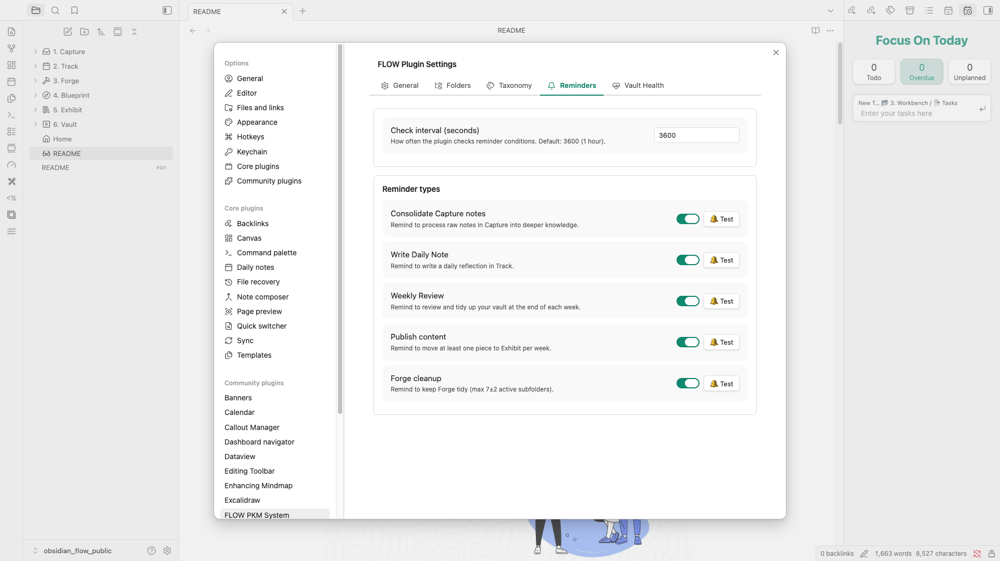
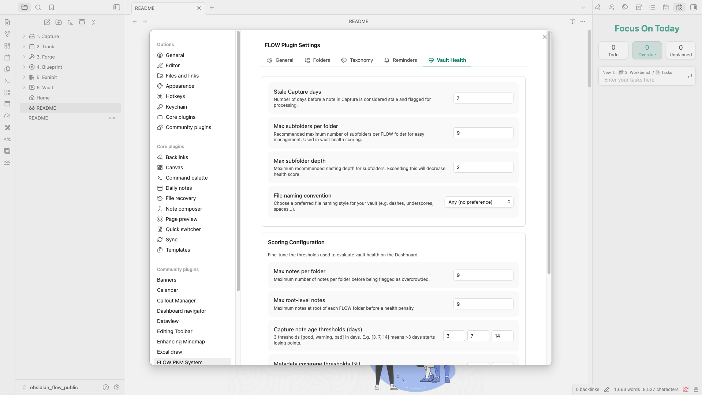
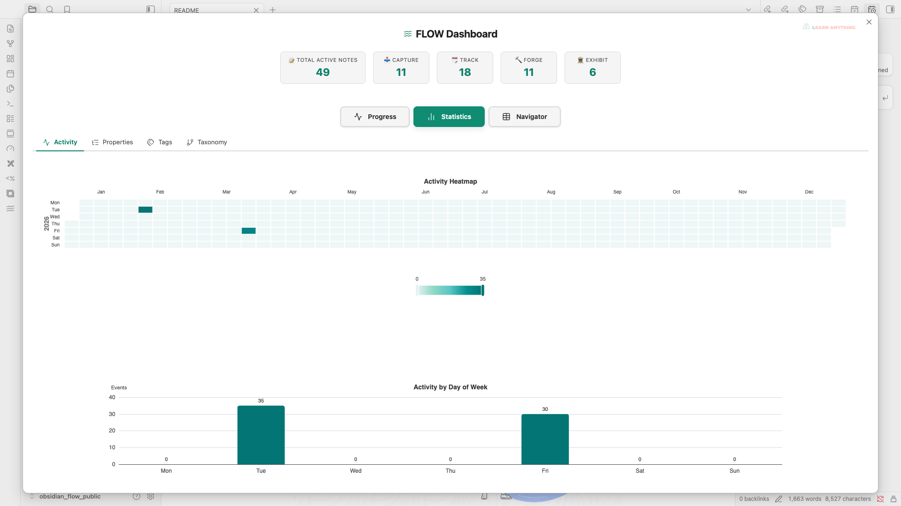
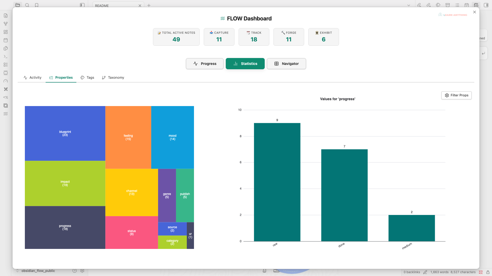
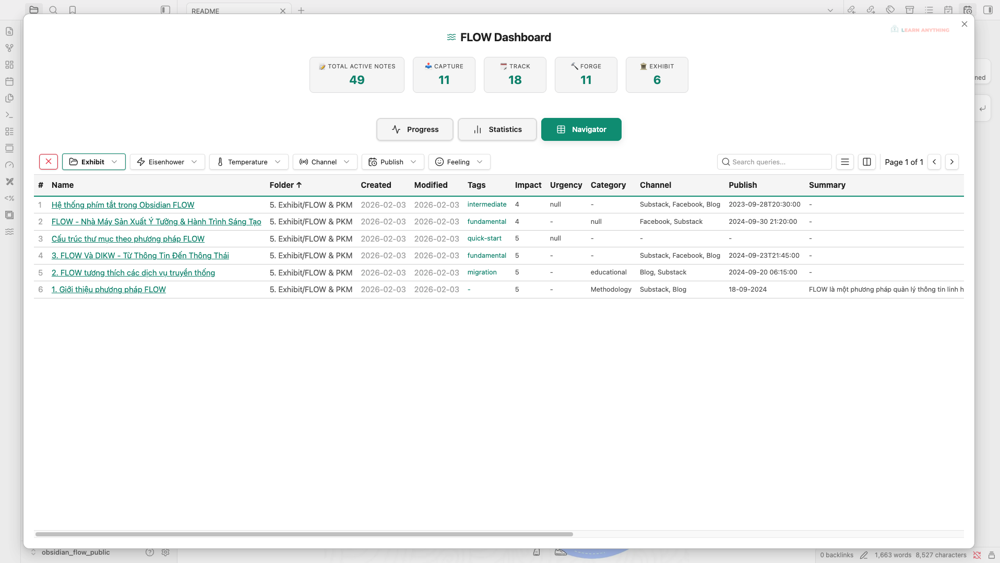
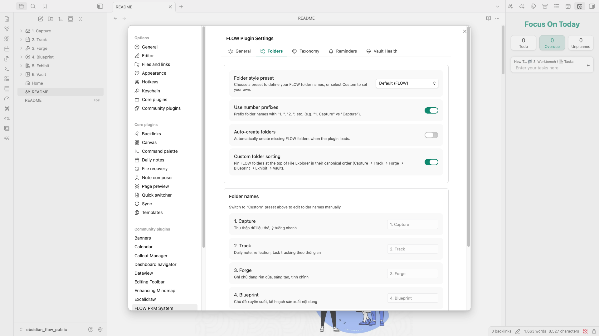
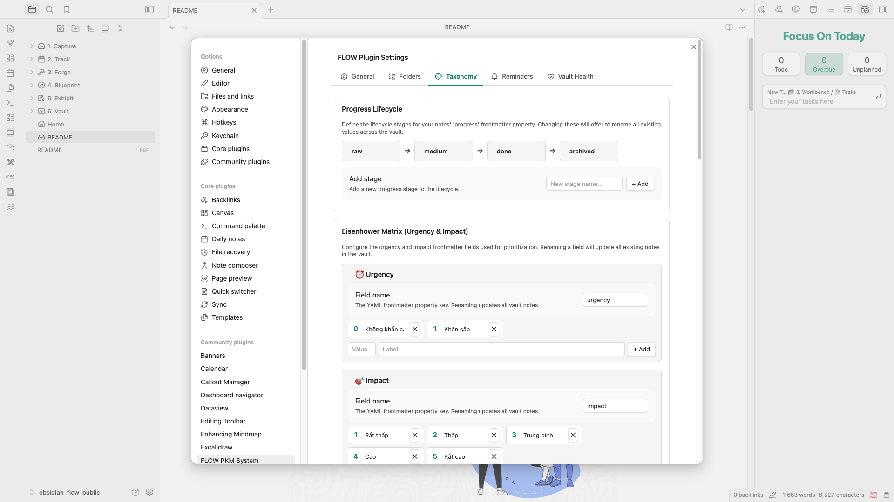

# Obsidian FLOW PKM

*Read this in other languages: [🇺🇸](#english) and[🇻🇳](#tiếng-việt) down below.*

---

## English

### Overview

Obsidian FLOW PKM is a comprehensive workspace management plugin designed to implement the FLOW methodology within Obsidian. It transforms your vault from a disorganized collection of notes into a structured, easily navigable, and highly actionable personal knowledge management (PKM) system. 

By providing interactive dashboards, health tracking capabilities, and visual progression workflows, this plugin helps you maintain a clean and highly effective vault—whether you are a student, professional, or creator aiming to maximize productivity.

### Core Functions & Capabilities
- **FLOW Dashboard & Progression Visualization**: Get a bird's-eye view of your knowledge base. Visualize your note lifecycle and methodology progression with interactive, canvas-style branching layouts. Check your current progress natively.

- **Vault Health Monitoring**: Keep your vault in top shape. Automatically track and evaluate key health metrics such as metadata coverage, file staleness, orphan attachments, subfolder depth, and naming conventions.

- **Activity Tracking**: Monitor your note-taking activity natively within Obsidian, helping you stay consistent with your knowledge-building habits.

- **Flexible Settings Management**: Backup your configurations or synchronize your personalized FLOW setup across multiple devices easily via Import & Export.

- **Taxonomy & Metadata Management**: Organize notes effectively. Utilize built-in tools like the Eisenhower Matrix (Urgency/Impact) and the Emotion Wheel for property suggestions, ensuring your notes are categorized for maximum utility without the friction.

### The Impact (Why Use FLOW?)
- **Clarity Over Clutter**: Navigate chaotic, overgrown vaults with ease. The plugin highlights precisely what needs attention, reducing friction and guiding you toward a more resilient structure.
- **Actionable Insights into Your Knowledge**: By understanding the state of your vault (e.g., forgotten stale notes, missing metadata), you can make informed, rapid decisions about what to review, update, or archive.
- **Seamless System Integration**: Integrates the proven FLOW PKM methodology directly into your daily workflow, saving you the mental overhead of manual organization so you can focus on reading and writing.

### How to Use
1. Install and enable the plugin from the Obsidian Community Plugins directory.
2. Open the **FLOW Dashboard** to view your vault's current state and your personalized health scoreboard.
3. Configure the **Vault Health Settings** to match your preferences (e.g., maximum subfolder depth, specific naming rules, and strictness).
4. Utilize the **Navigator** and **Blueprint** cards to filter, discover, and manage your notes effectively on a day-to-day basis.

### Credits & Support
- **Author**: Thịnh Vũ
- **Website**: [http://learn-anything.vn](http://learn-anything.vn)
- **FLOW PKM Methodology**: [https://learn-anything.vn/download-obsidian-flow](https://learn-anything.vn/download-obsidian-flow)
- **Obsidian FLOW Course**: [https://learn-anything.vn/khoa-hoc/lp-khoa-hoc-obsidian-flow](https://learn-anything.vn/khoa-hoc/lp-khoa-hoc-obsidian-flow)

**Support the Development**  
If you find this plugin helpful, consider supporting the author:
- **GitHub Sponsor**: [https://github.com/sponsors/thinh-vu](https://github.com/sponsors/thinh-vu)
- **Buy me a coffee (Vietnam Bank Transfer)**: [https://learn-anything.vn/store](https://learn-anything.vn/store)

---

## Tiếng Việt

### Tổng quan
Obsidian FLOW PKM là một plugin quản lý không gian làm việc toàn diện, được thiết kế để áp dụng phương pháp FLOW trực tiếp vào Obsidian. Plugin này giúp chuyển đổi từ một vault (kho lưu trữ) ghi chú lộn xộn, thiếu tổ chức thành một hệ thống quản lý tri thức cá nhân (PKM) có cấu trúc, dễ điều hướng và mang tính thực thi cao. 

Bằng cách cung cấp các bảng điều khiển (dashboard) trực quan, theo dõi sức khoẻ của vault, và biểu đồ tiến trình, plugin giúp bạn duy trì một hệ thống ghi chú sắc bén và hiệu quả cho dù bạn là sinh viên, người đi làm hay nhà sáng tạo nội dung đang muốn tối ưu hoá hiệu suất công việc.

### Tính năng & Chức năng cốt lõi
- **Bảng điều khiển FLOW & Trực quan hoá tiến trình**: Cung cấp cái nhìn toàn cảnh về kho tri thức của bạn. Trực quan hoá vòng đời ghi chú và tiến trình áp dụng phương pháp luận với giao diện dạng mạng lưới phân nhánh dễ hiểu. Theo dõi tiến độ mỗi ngày.
- **Theo dõi "Sức khoẻ" Vault (Vault Health)**: Giữ cho kho lưu trữ của bạn luôn gọn gàng và chuẩn mực. Tự động theo dõi các chỉ số quan trọng như mức độ hoàn thiện siêu dữ liệu (metadata), các ghi chú đã cũ (stale files), tệp đính kèm mồ côi (orphan attachments), giới hạn độ sâu của thư mục, và quy ước đặt tên.
- **Quản lý phân loại & Siêu dữ liệu (Taxonomy)**: Hệ thống hoá ghi chú một cách thiết thực. Sử dụng các công cụ tích hợp như Ma trận Eisenhower (Mức độ khẩn cấp/Quan trọng) và Vòng tròn cảm xúc (Emotion Wheel) để gợi ý thuộc tính, đảm bảo mọi ghi chú đều được phân loại tối ưu mà không gây quá tải.
- **Theo dõi hoạt động**: Nắm bắt tần suất và hiệu quả tạo ghi chú ngay bên trong Obsidian, giúp bạn duy trì thói quen xây dựng tri thức.
- **Quản lý Cài đặt linh hoạt**: Dễ dàng sao lưu (Export) và đồng bộ (Import) thiết lập FLOW cá nhân hoá của bạn sang các thiết bị khác.

### Giá trị mang lại (Impact)
- **Sự rõ ràng thay vì Hỗn loạn**: Dễ dàng điều hướng trong một vault khổng lồ. Plugin làm nổi bật chính xác những điểm cần chú ý, giảm ma sát và định hướng bạn xây dựng hệ thống bền vững hơn, tối giản hơn.
- **Thông tin hỗ trợ hành động**: Khi nắm rõ tình trạng thực tế của vault (như ghi chú lâu chưa đụng tới lại bị lãng quên, thiếu metadata quan trọng), bạn có thể chủ động ra quyết định nhanh chóng xem nên ôn tập, cập nhật hay đơn giản là lưu trữ (archive) lại ghi chú đó.
- **Làm việc theo hệ thống chuyên nghiệp**: Đưa các nguyên lý cốt lõi của phương pháp FLOW PKM đã được kiểm chứng vào ngay trong công việc hàng ngày, giúp bạn loại bỏ gánh nặng tinh thần phải tổ chức thủ công để chỉ tập trung vào việc đọc và ghi chép.

### Hướng dẫn sử dụng
1. Cài đặt và kích hoạt plugin từ phần Cộng đồng (Community Plugins) của Obsidian.
2. Mở **Bảng điều khiển FLOW (FLOW Dashboard)** để xem tình trạng và biểu đồ điểm sức khoẻ (scoreboard) hiện tại của kho lưu trữ (vault).
3. Tuỳ chỉnh phần **Cài đặt Vault Health** cho phù hợp với nhu cầu sử dụng cá nhân (ví dụ: độ sâu tối đa của thư mục, quy tắc đặt tên cụ thể, mức độ khắt khe).
4. Sử dụng công cụ **Navigator** và các thẻ **Blueprint** để lọc, khám phá và làm việc với các ghi chú một cách cực kỳ hiệu quả mỗi ngày.

### Bản quyền & Hỗ trợ
- **Tác giả**: Thịnh Vũ
- **Website**: [http://learn-anything.vn](http://learn-anything.vn)
- **Phương pháp FLOW PKM**: [https://learn-anything.vn/download-obsidian-flow](https://learn-anything.vn/download-obsidian-flow)
- **Khoá học về Obsidian FLOW**: [https://learn-anything.vn/khoa-hoc/lp-khoa-hoc-obsidian-flow](https://learn-anything.vn/khoa-hoc/lp-khoa-hoc-obsidian-flow)

**Ủng hộ tác giả**  
Nếu bạn cảm thấy plugin này hữu ích và đem lại giá trị, hãy cân nhắc đóng góp để duy trì và phát triển:
- **Tài trợ qua GitHub**: [https://github.com/sponsors/thinh-vu](https://github.com/sponsors/thinh-vu)
- **Gửi tặng ly cafe (Chuyển khoản Ngân hàng Việt Nam)**: [https://learn-anything.vn/store](https://learn-anything.vn/store)
